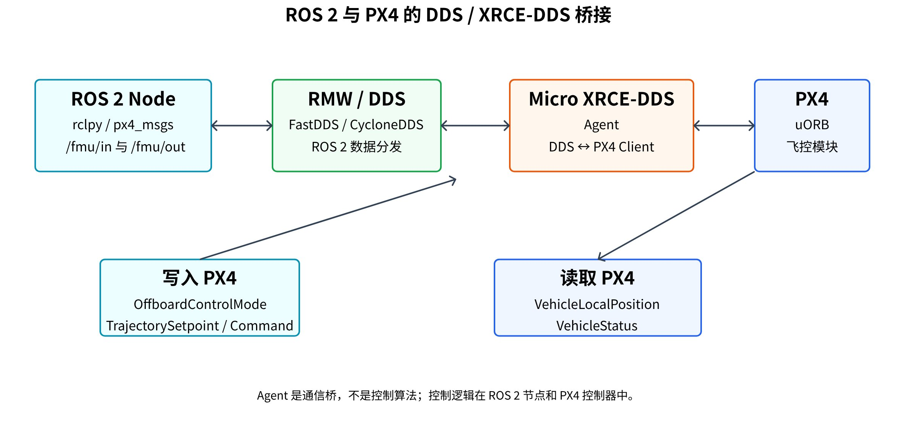
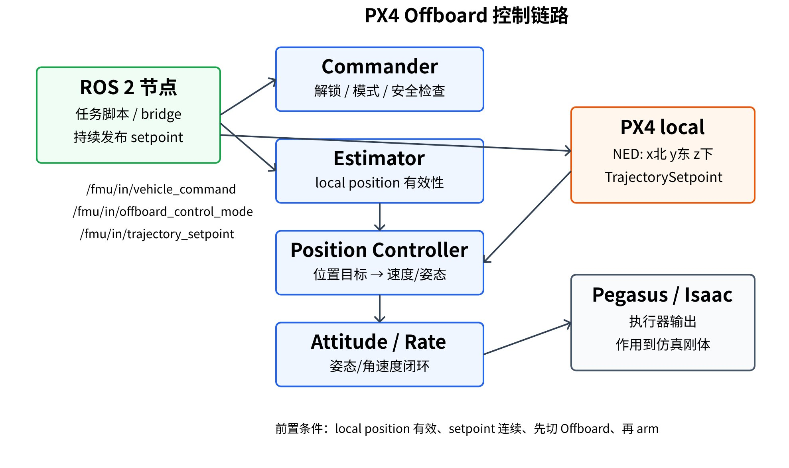

# 模块一：基础概念与仿真控制链路

学习目标：

- 知道无人机仿真为什么要走飞控闭环。
- 说清 Isaac Sim、Pegasus、PX4、QGC、ROS 2 分别负责什么。
- 理解 PX4 的几个基础概念：local position、模式切换、arm、持续 setpoint。

前置条件：

- 使用 Ubuntu 20.04，并安装 ROS 2 Foxy。
- Isaac Sim 可以正常启动。
- 了解 USD 资产、ROS 2 topic、PX4/QGC 的基本概念。


### 01 课程导学与整体目标

本文档采用以下控制路线：

```text
Isaac Sim 场景
  -> Pegasus Simulator 加载无人机并连接 PX4
  -> PX4 SITL 执行飞控逻辑
  -> QGroundControl 做状态监控和手动控制
  -> ROS 2 / px4_msgs 做 Offboard 自动控制
```

整体关系可以这样理解：QGC 看飞控状态，ROS 2 发控制目标，Pegasus 把 PX4 的执行器输出作用到 Isaac Sim 里的无人机。

### 02 仿真模型加载查看资产情况

在 Isaac Sim 里，可以直接改无人机 USD prim 的位置，比如在界面里拖动模型，或者用脚本设置 `/World/quadrotor` 的 transform。

这种方式适合检查资产：

- 模型是否加载完整。
- 朝向、比例、碰撞体、传感器位置是否准确。
- 起飞点或桌面位置是否合适。

但这不算飞行控制。直接拖模型没有飞控闭环：

- 不需要 arm。
- 不需要切飞行模式。
- 不受速度、加速度、姿态限制。
- 不经过 PX4 的 failsafe 和 preflight check。
- 不能说明真实无人机能飞。

因此，控制无人机时应使用飞控链路。

### 03 Isaac Sim、Pegasus、PX4、QGC、ROS 2 的角色分工

Isaac Sim 是 NVIDIA 的机器人仿真平台。在无人机仿真里，它主要负责：

- 加载 USD 场景和资产。
- 运行物理仿真。
- 提供相机、IMU 等仿真传感器能力。
- 通过 ROS 2 Bridge 发布仿真数据、TF、clock。
- 作为 Pegasus 的运行环境。

Isaac Sim 能加载无人机模型，但它不会自动让模型具备 PX4 飞控逻辑。想让模型像现实世界无人机一样飞行，需要 Pegasus 和 PX4。

Pegasus Simulator 是 Isaac Sim 上的无人机仿真插件。它主要做这些事：

- 加载多旋翼无人机模型。
- 管理多旋翼动力学参数。
- 绑定旋翼、机体、质量、惯量。
- 支持 PX4 MAVLink backend。
- 启动或连接 PX4 SITL。
- 提供 UI，用来选择无人机、场景和 backend。
- 每个仿真步读取 PX4 actuator 输出，再对 Isaac Sim 中的刚体或旋翼施加力和力矩。

可以先把 Pegasus 理解成：

```text
Pegasus = Isaac Sim 中的无人机插件
        = 多旋翼模型 + 动力学 + PX4 后端 + UI + 传感器接入
```

QGroundControl 通常简称 QGC，是无人机地面站。它通过 MAVLink 连接 PX4。调试过程中建议保持 QGC 打开，便于查看飞控状态和告警信息。

QGC 常用来：

- 看飞机是否连接。
- 看是否 Ready To Fly。
- 看飞行模式、解锁状态、告警。
- 设置参数。
- 用虚拟摇杆或手柄控制飞行。
- 查看日志和定位状态。


ROS 2 在这个链路里负责外部自动控制。它不直接控制 Isaac Sim 的模型，而是通过 `/fmu/in/*` 话题把控制目标发给 PX4，再由 PX4 控制无人机。

在本文档的流程中，Pegasus 主要负责：

- 把无人机 USD 绑定成 Pegasus 的 `Multirotor` 对象。
- 使用 `PX4MavlinkBackend` 连接 PX4。
- 让 PX4 的执行器输出作用到 Isaac Sim 里的无人机。
- 提供 `vehicle.state`，供外部脚本读取无人机位置、姿态、速度等状态。
- 支持由 Pegasus 创建无人机，也支持在脚本里绑定已有的 `/World/quadrotor`。

有两种接入方式：

| 接入方式 | 典型场景 | 说明 |
| --- | --- | --- |
| 由 Pegasus 创建无人机 | 简单场景、单独加载无人机 | 调用 `Multirotor(DRONE_PRIM, DRONE_ASSET_USD, ...)` |
| 绑定已有无人机 prim | USD 场景里已经有 `/World/quadrotor` | 脚本调用 `Multirotor(..., attach_existing=True)` 绑定已有 prim。这个能力需要你的 Pegasus 版本或本地修改支持 |


### 04 PX4 基础架构与控制条件

PX4 Autopilot 是开源飞控软件。它可以跑在真实飞控硬件上，也可以用 SITL 形式跑在电脑里。SITL 是 Software In The Loop。仿真和实机使用同一套飞控逻辑，区别在于数据来源：实机来自真实传感器，仿真来自 Isaac Sim 和 Pegasus。

在 Isaac Sim + Pegasus + PX4 里：

- Isaac Sim 提供世界、物理和传感器。
- Pegasus 把无人机模型和 PX4 后端连接起来。
- PX4 负责模式、状态估计、控制器和安全检查。

PX4 内部常见模块：

| 模块 | 作用 | 简要记忆 |
| --- | --- | --- |
| Commander | 管理解锁、上锁、飞行模式、安全状态 | 无人机不能飞时，先看 preflight check |
| Estimator | 融合 IMU、GPS、视觉或仿真位姿，得到状态估计 | local position 无效时，Offboard 位置控制很难正常工作 |
| Controllers | 位置、速度、姿态、角速度控制 | 外部给位置目标，PX4 内部会逐级转成姿态和执行器输出 |
| Navigator | 任务、返航、降落等高级导航逻辑 | 自动任务、返航、降落会涉及它 |
| MAVLink | PX4 和 QGC、仿真器、外部程序通信 | QGC 通常通过 MAVLink 连接 PX4 |
| uORB | PX4 内部发布订阅总线 | ROS 2 无法直接控制 uORB，而是通过桥接消息交互 |

想让 PX4 控制无人机，至少要有这些东西：

| 条件 | 说明 |
| --- | --- |
| 飞控软件 | PX4-Autopilot，仿真时通常运行 PX4 SITL |
| 无人机动力学 | Pegasus 根据多旋翼模型在 Isaac Sim 中施加力和力矩 |
| 通信链路 | MAVLink 或 uXRCE-DDS / ROS 2 bridge |
| 状态估计 | PX4 需要知道本地位置、姿态、速度 |
| 控制目标 | QGC 手动命令，或 ROS 2 发送的 Offboard setpoint |
| 安全状态 | 通过 preflight check，进入正确模式并 arm |

### 05 QGC、MAVLink、uXRCE-DDS、ROS 2 Bridge 通信链路

QGC 发的是飞控命令。PX4 会先判断命令能不能执行，再通过控制器输出执行器命令。这个过程更接近真实飞机。

PX4 内部用 uORB。ROS 2 用 DDS。两边不能直接传输数据，需要桥接器进行连接。

PX4 和 ROS 2 通信常用 uXRCE-DDS：

- PX4 侧运行 uXRCE-DDS Client。
- 电脑侧运行 Micro XRCE-DDS Agent。
- ROS 2 侧使用 `px4_msgs` 里的消息定义。
- 外部节点通过 `/fmu/in/*` 写入 PX4，通过 `/fmu/out/*` 读取 PX4。



常见输入输出话题：

| 方向 | 话题 | 消息 | 作用 |
| --- | --- | --- | --- |
| ROS 2 -> PX4 | `/fmu/in/offboard_control_mode` | `px4_msgs/msg/OffboardControlMode` | 声明外部控制模式 |
| ROS 2 -> PX4 | `/fmu/in/trajectory_setpoint` | `px4_msgs/msg/TrajectorySetpoint` | 发送位置、速度、加速度、yaw setpoint |
| ROS 2 -> PX4 | `/fmu/in/vehicle_command` | `px4_msgs/msg/VehicleCommand` | 切模式、arm、land、disarm |
| PX4 -> ROS 2 | `/fmu/out/vehicle_local_position` | `px4_msgs/msg/VehicleLocalPosition` | PX4 本地位置估计 |
| PX4 -> ROS 2 | `/fmu/out/vehicle_status` | `px4_msgs/msg/VehicleStatus` | 飞行模式、解锁状态 |

Isaac Sim ROS 2 Bridge 可以把仿真数据发布到 ROS 2，例如：

- `/clock`
- TF
- odometry
- camera image

### 06 常见控制方式对比

| 控制方式 | 适合做什么 | 不适合做什么 |
| --- | --- | --- |
| 直接移动模型 | 检查 USD 资产、起始位置、传感器位置 | 不能说明飞控链路正常，也不能训练真实飞行控制 |
| QGC 手动控制 | 检查 PX4 是否 Ready To Fly，训练 arm、takeoff、land | 不适合自动任务和程序化路径控制 |
| PX4 Offboard 控制 | 用 ROS 2 或外部程序发 setpoint 自动飞行 | 需要 local position 有效，且必须持续发布 setpoint |

Offboard 是 PX4 给外部计算机控制用的模式。外部程序持续发送 setpoint，比如位置、速度、姿态目标，PX4 再根据这些目标控制无人机。

最常见的 Offboard 流程是：

1. ROS 2 节点持续发布 `OffboardControlMode`。
2. ROS 2 节点持续发布 `TrajectorySetpoint`。
3. ROS 2 节点发送 `VehicleCommand`，把 PX4 切到 Offboard。
4. ROS 2 节点发送 arm 命令。
5. PX4 接收目标点并控制无人机。

需要注意的是持续发布。PX4 不接受只发送一次 setpoint 的外部控制。setpoint 或 Offboard 控制模式停止后，PX4 会认为外部链路中断，并退出 Offboard 或触发 failsafe。


