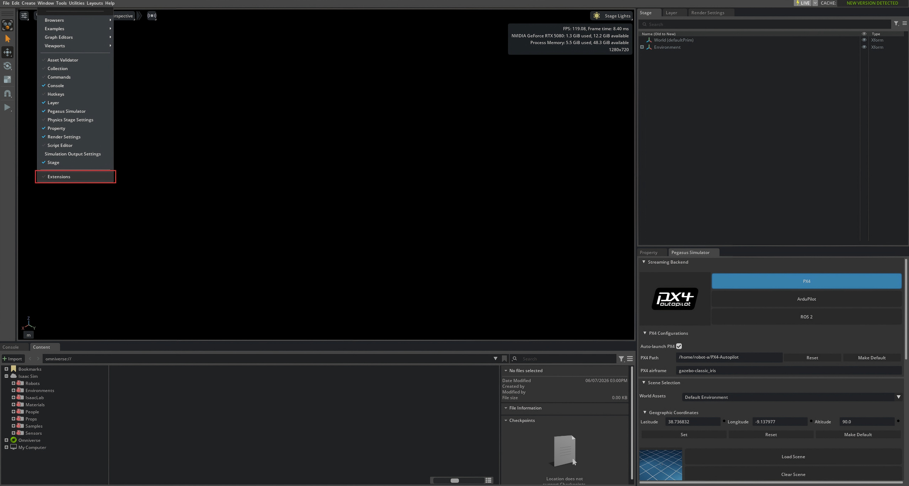
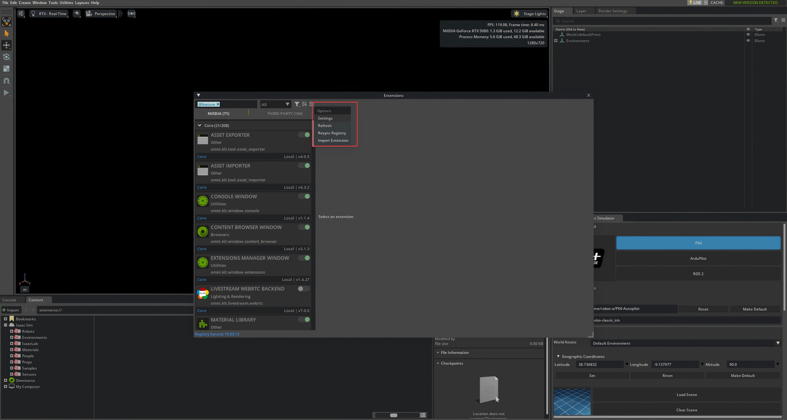
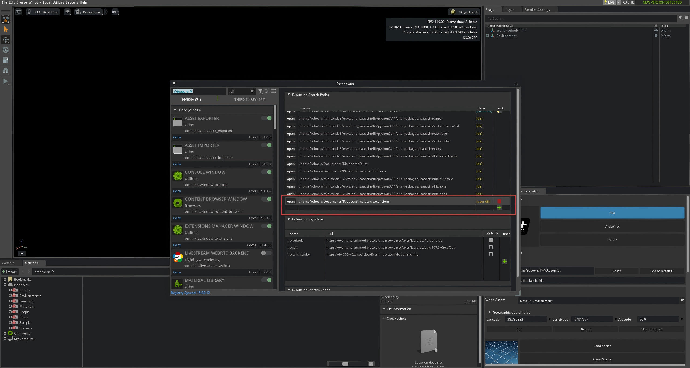
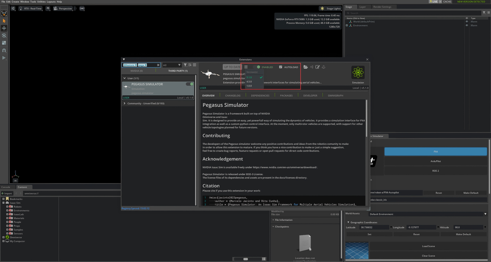
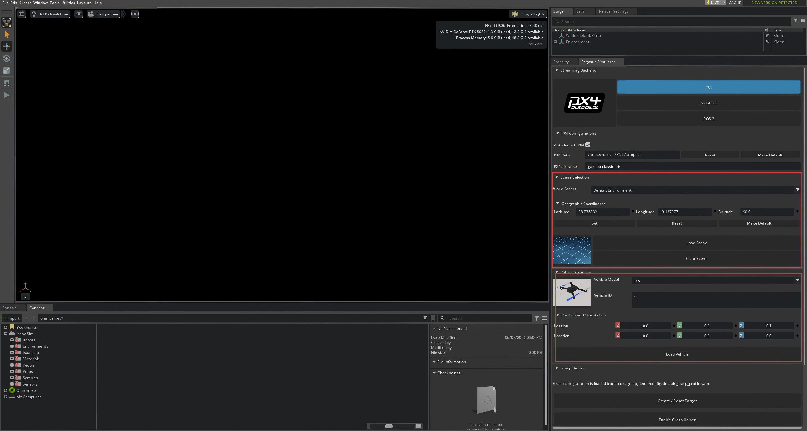
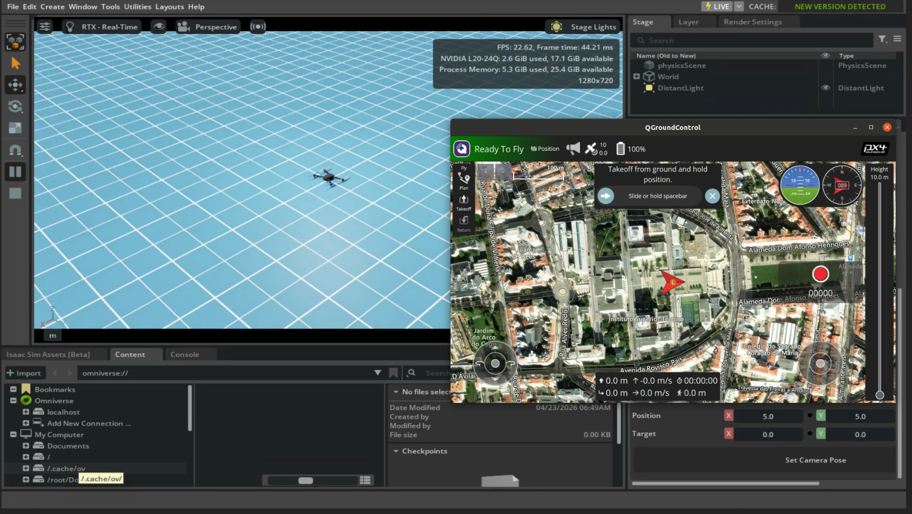
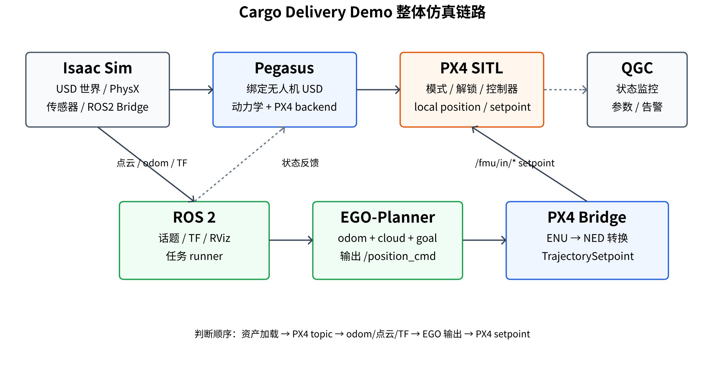
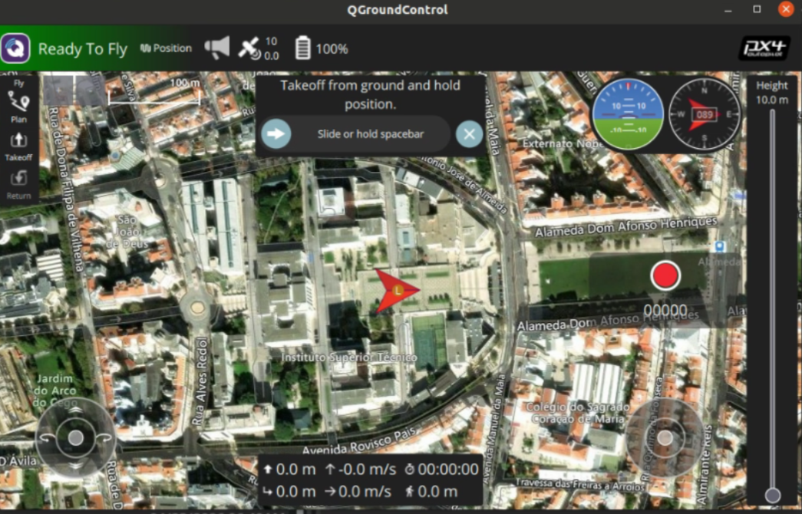

# 模块二：Isaac Sim + Pegasus + PX4 官方 Iris 试飞

说明目标：

- 安装并启用 Pegasus 插件。
- 理解 PX4-Autopilot、px4_msgs、Micro XRCE-DDS Agent、QGC 的作用。
- 使用 Pegasus 官方 Iris 验证最小飞行闭环。

前置条件：

- 已理解模块一中的基础链路。
- 操作系统可以是 Ubuntu 20.04、Ubuntu 22.04 或 Ubuntu 24.04。
- ROS 2 控制终端按系统选择 Foxy、Humble 或 Jazzy。
- Isaac Sim 能正常启动。
- 能打开终端执行基础命令。

验证目标：

- Isaac Sim 中能加载 Iris。
- Pegasus 能启动 PX4 backend。
- QGC 能连接 PX4 并显示 Ready To Fly。
- 能用 QGC 手动 arm、takeoff、移动、land。


### 01 Pegasus 插件安装与启用

Pegasus 插件安装分为两个步骤：将 Pegasus 安装到 Isaac Sim 使用的 Python 环境，然后在 Isaac Sim GUI 中添加 extension 路径并启用插件。

验证环境中的 Pegasus 源码位置：

```text
/home/robot-a/Documents/PegasusSimulator
```

如需复现 Pegasus 安装流程，可使用 Isaac Sim 环境中的 Python：

```bash
export ISAACSIM_BIN=/home/robot-a/miniconda3/envs/env_isaacsim/bin/isaacsim
export ISAACSIM_PYTHON=/home/robot-a/miniconda3/envs/env_isaacsim/bin/python
export PEGASUS_ROOT=/home/robot-a/Documents/PegasusSimulator

cd ${PEGASUS_ROOT}
git status --short --branch

${ISAACSIM_PYTHON} -c "import sys; print(sys.executable)"
${ISAACSIM_PYTHON} -m pip install -e ${PEGASUS_ROOT}/extensions/pegasus.simulator
```

当前项目脚本会通过 `sys.path` 加入 `/home/robot-a/Documents/PegasusSimulator/extensions/pegasus.simulator`，因此脚本加载目标无人机时可以直接找到 Pegasus Python 包。

安装完成后，启动 Isaac Sim GUI。在菜单栏进入：

```text
Window -> Extensions
```



在 Extensions 界面右上角打开 `Settings`，把 Pegasus extension 路径加入 Isaac Sim 的搜索路径。



点击路径列表旁边的加号，添加 Pegasus 源码里的 `extensions` 目录。需注意，添加对象是 `extensions` 目录，不是其中的 `pegasus.simulator` 子目录。

常见路径：

```bash
/home/robot-a/Documents/PegasusSimulator/extensions
```



路径添加完成后，在左上角搜索 `pegasus`。路径正确时，列表里会出现 Pegasus 插件。点击 `Install` 安装。



选择和 Isaac Sim 版本匹配的插件版本。验证环境使用本地 `/home/robot-a/Documents/PegasusSimulator`，添加路径后勾选 `Enabled`。


### 02 PX4-Autopilot、px4_msgs、Micro XRCE-DDS Agent、QGC 的作用

本节说明验证环境中已安装的软件包，并给出在单独目录中重新下载和编译的复现流程。复现安装流程时，应避免移动或删除现有可用目录。

验证环境关键路径：

```text
PX4-Autopilot: /home/robot-a/PX4-Autopilot
px4_msgs: /home/robot-a/ros2_ws/src/px4_msgs
Micro XRCE-DDS Agent: /home/robot-a/px4_agent_ws/src/Micro-XRCE-DDS-Agent
Micro XRCE-DDS Agent binary: /home/robot-a/px4_agent_ws/install/microxrcedds_agent/bin/MicroXRCEAgent
QGroundControl: /home/robot-a/Downloads/QGroundControl.AppImage
```

系统版本和 ROS 2 版本按下表对应：

| Ubuntu | ROS 2 | source 命令 |
| --- | --- | --- |
| 20.04 | Foxy | `source /opt/ros/foxy/setup.bash` |
| 22.04 | Humble | `source /opt/ros/humble/setup.bash` |
| 24.04 | Jazzy | `source /opt/ros/jazzy/setup.bash` |

验证环境为 Ubuntu 24.04.4，宿主机 ROS 2 控制终端使用 Jazzy：

```bash
source /opt/ros/jazzy/setup.bash
source /home/robot-a/ros2_ws/install/setup.bash
```

需注意：`/home/robot-a/run_isaacsim.sh` 内部会为 Isaac Sim ROS 2 Bridge 设置 `ROS_DISTRO=humble` 和 `RMW_IMPLEMENTATION=rmw_cyclonedds_cpp`。这属于 Isaac Sim 启动环境，不等同于控制终端需要 source Humble。

安装基础工具：

```bash
sudo apt update
sudo apt install -y \
  git wget curl gnupg2 lsb-release software-properties-common \
  build-essential cmake ninja-build python3-pip python3-venv
```

设置 locale：

```bash
sudo apt update
sudo apt install -y locales
sudo locale-gen en_US en_US.UTF-8
sudo update-locale LC_ALL=en_US.UTF-8 LANG=en_US.UTF-8
export LANG=en_US.UTF-8
```

确认对应 ROS 2 发行版已安装：

Ubuntu 20.04 + Foxy：

```bash
ls /opt/ros
source /opt/ros/foxy/setup.bash
ros2 --version
```

Ubuntu 22.04 + Humble：

```bash
ls /opt/ros
source /opt/ros/humble/setup.bash
ros2 --version
```

Ubuntu 24.04 + Jazzy：

```bash
ls /opt/ros
source /opt/ros/jazzy/setup.bash
ros2 --version
```

初始化 `rosdep`：

```bash
sudo rosdep init
rosdep update
```

每个新的 ROS 2 控制终端均需要 source：

Ubuntu 20.04 + Foxy：

```bash
source /opt/ros/foxy/setup.bash
source /home/robot-a/ros2_ws/install/setup.bash
```

Ubuntu 22.04 + Humble：

```bash
source /opt/ros/humble/setup.bash
source /home/robot-a/ros2_ws/install/setup.bash
```

Ubuntu 24.04 + Jazzy：

```bash
source /opt/ros/jazzy/setup.bash
source /home/robot-a/ros2_ws/install/setup.bash
```

PX4-Autopilot 是飞控代码仓库。仿真时运行的是 PX4 SITL。Pegasus 通过 PX4 MAVLink backend 启动或连接它。

PX4-Autopilot 负责这些飞控逻辑：

- 飞控状态机。
- arm、disarm、mode switch。
- 接收 QGC 或 ROS 2 的目标。
- 输出执行器控制。

验证环境位置：

```bash
/home/robot-a/PX4-Autopilot
```

验证已有安装时执行：

```bash
cd /home/robot-a/PX4-Autopilot
git describe --tags --always --dirty
make px4_sitl_default
```

如需重新下载并编译，安装目录可自行选择：

```bash
mkdir -p /home/robot-a/px4_install_demo
cd /home/robot-a/px4_install_demo
git clone https://github.com/PX4/PX4-Autopilot.git --recursive
cd PX4-Autopilot
bash ./Tools/setup/ubuntu.sh
make px4_sitl_default
```

如果 Pegasus 要自动启动 PX4，Pegasus UI 里的 PX4 路径应指向这个目录：

```text
/home/robot-a/PX4-Autopilot
```

版本要对齐：

- Pegasus、PX4、`px4_msgs` 要匹配。
- 验证环境的 PX4 仓库为 `/home/robot-a/PX4-Autopilot`，当前描述版本类似 `v1.17.0-alpha1-1219-g30bbd6ecd4`。
- `px4_msgs` 和 PX4 版本不一致时，ROS 2 topic 可能出现，但消息字段会对不上。

`px4_msgs` 是 PX4 和 ROS 2 通信用的消息定义包。ROS 2 节点要发布 `OffboardControlMode`、`TrajectorySetpoint`、`VehicleCommand`，就需要它。

它的作用包括：

- 提供 PX4 输入输出消息类型。
- 让 ROS 2 节点能编译和运行 PX4 控制代码。
- 保持 ROS 2 消息和 PX4 uORB 消息对应。

验证环境位置：

```bash
/home/robot-a/ros2_ws/src/px4_msgs
```

验证已有安装时执行：

Ubuntu 20.04 + Foxy：

```bash
source /opt/ros/foxy/setup.bash
source /home/robot-a/ros2_ws/install/setup.bash
ros2 interface show px4_msgs/msg/TrajectorySetpoint
```

Ubuntu 22.04 + Humble：

```bash
source /opt/ros/humble/setup.bash
source /home/robot-a/ros2_ws/install/setup.bash
ros2 interface show px4_msgs/msg/TrajectorySetpoint
```

Ubuntu 24.04 + Jazzy：

```bash
source /opt/ros/jazzy/setup.bash
source /home/robot-a/ros2_ws/install/setup.bash
ros2 interface show px4_msgs/msg/TrajectorySetpoint
```

如需在重新下载和编译`px4_msgs` ，流程如下：

Ubuntu 20.04 + Foxy：

```bash
mkdir -p /home/robot-a/px4_install_demo/ros2_ws/src
cd /home/robot-a/px4_install_demo/ros2_ws/src
git clone https://github.com/PX4/px4_msgs.git

cd /home/robot-a/px4_install_demo/ros2_ws
source /opt/ros/foxy/setup.bash
/usr/bin/python3 -m colcon build --symlink-install --packages-select px4_msgs
source install/setup.bash
```

Ubuntu 22.04 + Humble：

```bash
mkdir -p /home/robot-a/px4_install_demo/ros2_ws/src
cd /home/robot-a/px4_install_demo/ros2_ws/src
git clone https://github.com/PX4/px4_msgs.git

cd /home/robot-a/px4_install_demo/ros2_ws
source /opt/ros/humble/setup.bash
/usr/bin/python3 -m colcon build --symlink-install --packages-select px4_msgs
source install/setup.bash
```

Ubuntu 24.04 + Jazzy：

```bash
mkdir -p /home/robot-a/px4_install_demo/ros2_ws/src
cd /home/robot-a/px4_install_demo/ros2_ws/src
git clone https://github.com/PX4/px4_msgs.git

cd /home/robot-a/px4_install_demo/ros2_ws
source /opt/ros/jazzy/setup.bash
/usr/bin/python3 -m colcon build --symlink-install --packages-select px4_msgs
source install/setup.bash
```

Jazzy 对应系统 Python 3.12。应避免使用 conda Python 3.13 编译 `px4_msgs`，否则运行控制脚本时可能出现 `libpython3.13.so.1.0` 或 `UnsupportedTypeSupport` 相关错误。这个部分需要注意自身的python版本的问题。

检查消息是否可用：

```bash
ros2 interface show px4_msgs/msg/TrajectorySetpoint
ros2 interface show px4_msgs/msg/OffboardControlMode
ros2 interface show px4_msgs/msg/VehicleCommand
```

Micro XRCE-DDS Agent 是 PX4 和 ROS 2 DDS 网络之间的桥。

缺少 Agent 时，常见现象包括：

- PX4 侧 uXRCE-DDS Client 发出的数据到不了 ROS 2。
- ROS 2 发给 `/fmu/in/*` 的数据到不了 PX4。
- 看不到 `/fmu/out/*`，或者话题有了但没有数据。

常见启动形式：

```bash
source /home/robot-a/px4_agent_ws/install/setup.bash
MicroXRCEAgent udp4 -p 8888
```

如果没有 source 到 PATH，也可以直接使用绝对路径：

```bash
/home/robot-a/px4_agent_ws/install/microxrcedds_agent/bin/MicroXRCEAgent udp4 -p 8888
```

端口和启动方式以实际 PX4 / Pegasus 配置为准。常用端口是 `8888`。

如果系统里没有 `MicroXRCEAgent`，可以从源码编译：

```bash
mkdir -p /home/robot-a/px4_install_demo/px4_agent_ws/src
cd /home/robot-a/px4_install_demo/px4_agent_ws/src
git clone --branch v2.4.3 https://github.com/eProsima/Micro-XRCE-DDS-Agent.git
cd Micro-XRCE-DDS-Agent
mkdir -p build
cd build
cmake ..
make -j$(nproc)
sudo make install
sudo ldconfig
```

检查命令：

```bash
MicroXRCEAgent --help
MicroXRCEAgent udp4 -p 8888
```

QGC 是地面站。它不是 ROS 2 控制的必需条件，但调试时可保持打开。

它可用于确认以下状态：

- PX4 是否连接。
- 是否 Ready To Fly。
- 当前模式、告警、参数是否正常。
- 虚拟摇杆或手柄是否可以控制飞行。
- PX4 拒绝 arm 或起飞的原因。

部分飞控问题在终端中不够直观，QGC 通常可以直接显示原因。

通用下载方式以 QGroundControl 官方下载页为准：

```text
https://docs.qgroundcontrol.com/master/en/qgc-user-guide/getting_started/download_and_install.html
```

进入该页面后，选择 Linux 版本的 AppImage，下载到系统后赋予执行权限：

```bash
cd ~/Downloads
chmod +x QGroundControl*.AppImage
./QGroundControl*.AppImage
```

验证环境已有 QGroundControl AppImage 时，也可以直接使用示例路径：

```bash
chmod +x /home/robot-a/Downloads/QGroundControl.AppImage
/home/robot-a/Downloads/QGroundControl.AppImage
```

如果 AppImage 报 `FUSE` 相关错误，按系统安装兼容包。

Ubuntu 20.04 / Ubuntu 22.04：

```bash
sudo apt update
sudo apt install -y libfuse2
```

Ubuntu 24.04：

```bash
sudo apt update
sudo apt install -y libfuse2t64
```

本流程要求 QGC 能连接 PX4、显示状态并进行手动控制，不强制使用最新版。

Isaac Sim ROS 2 Bridge 需要在安装 Isaac Sim 时就安装好。它负责把仿真数据发布到 ROS 2，例如 `/clock`、TF、odometry、camera image。

### 03 Pegasus UI 配置与 PX4 路径检查

启用成功后，Isaac Sim 里会出现 Pegasus UI。使用前先检查：

- PX4 路径是否和前面安装的 `PX4-Autopilot` 路径一致。
- `Load Scene` 是否能加载插件自带环境。
- `Load Vehicle` 是否能加载插件自带的 Iris。
- Backend 是否选择 PX4。

如果 PX4 路径不正确，Pegasus UI 可能可以打开，但加载无人机或启动 PX4 backend 时会失败。



启动 QGC 的常见命令：

```bash
cd ~/Downloads
./QGroundControl*.AppImage
```

QGC 连接后显示 `Ready To Fly`，说明 Pegasus、PX4、QGC 的基础链路已连通。

### 04 加载官方 Iris 无人机

Iris 是 PX4/Pegasus 常用的官方四旋翼示例机型。

Iris 的资产和动力学参数已经配置完成，PX4 airframe 通常也匹配。Iris 可正常飞行时，说明 Pegasus、PX4、QGC、MAVLink 基础链路基本正常。



通用流程：

1. 启动 Isaac Sim。
2. 启用 Pegasus 插件。
3. 在 Pegasus UI 中选择官方 Iris。
4. 选择 PX4 backend。
5. 加载场景。
6. 等待 PX4 SITL 启动。
7. 打开 QGroundControl。
8. 确认 QGC 连接 PX4。
9. 确认 Ready To Fly。
10. 使用 QGC 虚拟摇杆或手柄起飞、移动、降落。

该链路关系如下：



Pegasus 负责在 Isaac Sim 里加载无人机和 PX4 backend；PX4 负责飞控状态机和控制器；QGC 负责地面站连接、状态检查和手动控制。

### 05 QGC 连接检查与 Ready To Fly 判断

进行代码控制时也可打开 QGC。PX4 无法 arm、拒绝起飞、模式切换失败时，QGC 通常会显示原因。

QGC 可使用虚拟摇杆，也可以接入手柄。检查顺序如下：

- 确认 QGC 能连接 PX4。
- 确认摇杆输入映射正确。
- 起飞前检查是否存在红色告警。
- PX4 未 Ready To Fly 时，不应强行 arm。



### 06 手动 arm、takeoff、移动、land

Iris 手动试飞用于确认 Isaac Sim、Pegasus、PX4、QGC 之间的基础链路是否正常。

按以下顺序检查：

```text
1. QGC 能看到 PX4 连接
2. QGC 显示 Ready To Fly
3. 可以 arm
4. 可以 takeoff
5. 可以用虚拟摇杆或手柄控制方向
6. 可以 land
```


### 07 基础链路故障排查

QGC 无法连接时，按以下项目检查：

```text
1. Pegasus 是否启动 PX4 backend
2. PX4 SITL 是否正在运行
3. MAVLink 端口是否被占用
4. QGC 是否和 PX4 在同一网络可达范围
5. 容器网络是否隔离
```

Iris 不能起飞时，按下面顺序检查：

- PX4 是否 Ready To Fly。
- QGC 是否有 preflight check 报错。
- 仿真 timeline 是否播放。
- Pegasus 是否正确加载 Iris。
- PX4 backend 是否正常。

PX4 topic 不出现时，检查：

```bash
ros2 topic list --no-daemon | grep fmu
```

如果没有 `/fmu/out/*`：

- 检查 Micro XRCE-DDS Agent。
- 检查 PX4 是否启动 uXRCE-DDS Client。
- 检查 ROS 2 RMW 是否和环境匹配。
- 检查是否 source 了 `px4_msgs` 工作空间。

### 08 Iris 试飞检查清单

- [ ] Pegasus 能加载 Iris。
- [ ] PX4 SITL 能启动。
- [ ] QGC 能连接。
- [ ] QGC 显示 Ready To Fly。
- [ ] 能 arm。
- [ ] 能 takeoff。
- [ ] 能通过摇杆或虚拟摇杆控制方向。
- [ ] 能 land。
