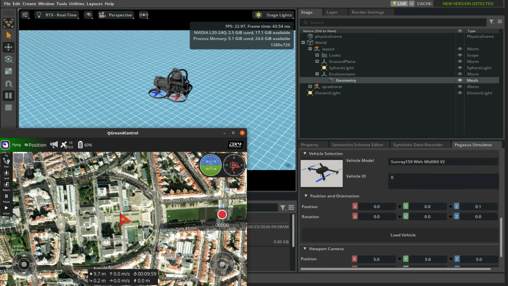

# 模块四：自定义无人机接入与目标资产说明

说明目标：

- 理解为什么不能只换一个 USD 文件。
- 知道自定义无人机需要 body、rotor、质量、惯量等结构。
- 掌握三种接入思路：Pegasus UI 注册、脚本加载、绑定已有 `/World/quadrotor`。

前置条件：

- 官方 Iris 已经能飞。
- ROS 2 Offboard 控制链路已经验证通过。
- 能区分问题出在 PX4、Pegasus、ROS 2 还是 USD 资产。

验证目标：

- 能加载自定义无人机资产。
- 能确认 `/World/quadrotor` 路径。
- 能确认 `/World/quadrotor/body` 路径。
- 能启动 PX4 backend。
- 能通过 QGC 或 ROS 2 控制自定义无人机。


### 01 自定义无人机接入条件

USD 能显示，不代表无人机能被 Pegasus/PX4 控制。要能飞，至少需要：

- 主机体 body。
- rotor prim。
- 合理的质量和惯量。
- 旋翼位置、方向、推力模型。
- 和 PX4 backend 匹配的 airframe / actuator 配置。
- 正确的 stage prim 路径。
- 如果需要传感器，还要挂载 camera、IMU 或其它传感器。

通常要准备：

| 内容 | 作用 |
| --- | --- |
| USD 资产 | 无人机外观、body、rotor、碰撞体、传感器位置 |
| 动力学参数 | 质量、惯量、旋翼位置、推力系数、力矩系数 |
| 车辆配置 | 告诉 Pegasus 如何创建 `Multirotor` |
| backend 配置 | 告诉 Pegasus 使用 PX4、ArduPilot 或自定义 backend |
| UI 注册 | 让 Pegasus UI 中可以选择该无人机 |

### 02 USD 资产结构要求

如需在 Pegasus UI 的 `Vehicle Model` 下拉框中选择自定义无人机，需要将资产放到 Pegasus 插件的资产目录：

```text
<PegasusSimulator>/extensions/pegasus.simulator/pegasus/simulator/assets/Robots/
```

路径示例：

```text
/home/robot-a/Documents/PegasusSimulator/extensions/pegasus.simulator/pegasus/simulator/assets/Robots/
```

如果仅通过脚本加载，不需要出现在 Pegasus UI 中，也可以将 USD 放在项目的 `assets/robots/` 下，然后在脚本中传入绝对路径或相对路径。

USD 的命名、层级和物理属性要符合 Pegasus 创建 `Multirotor` 的要求。也可以由脚本明确告诉 Pegasus 这些 prim 在哪里。满足这些条件后，外部 USD 资产才可能变成可控无人机。

### 03 Pegasus UI 注册新机型

Pegasus UI 的车辆列表来自插件源码中的 `ROBOTS` 字典。需要修改的文件是：

```text
<PegasusSimulator>/extensions/pegasus.simulator/pegasus/simulator/params.py
```

在这个文件里可以看到类似内容：

```python
ROBOTS_ASSETS = ASSET_PATH + "/Robots"

ROBOTS = {
    "Iris": ROBOTS_ASSETS + "/Iris/iris.usd",
    "Sunray150": ROBOTS_ASSETS + "/sunray150/sunray150.usda",
}
```

如果要新增 `MyDrone`，可以按这个思路加一项：

```python
ROBOTS = {
    "Iris": ROBOTS_ASSETS + "/Iris/iris.usd",
    "MyDrone": ROBOTS_ASSETS + "/MyDrone/my_drone.usda",
}
```

然后把 USD 和它引用的 mesh、材质、子层文件放到：

```text
pegasus/simulator/assets/Robots/MyDrone/
```

修改后需要重启 Isaac Sim，重新启用 Pegasus 插件。这样 UI 的 `Vehicle Model` 下拉框里才会出现新无人机。

Pegasus UI 加载车辆时会走 `ui/ui_delegate.py`。核心逻辑是根据 `robot_key` 从 `ROBOTS` 中取 USD 路径，然后调用 `Multirotor(...)` 创建无人机。也就是说，`params.py` 只解决“UI 能否选到资产”。无人机能否飞行，还取决于 USD 结构、动力学参数和 PX4 backend 是否匹配。

### 04 脚本加载无人机


替换为自定义无人机时，通常需要修改：

| 配置 | 说明 |
| --- | --- |
| `DRONE_ASSET_USD` | 指向新的无人机 USD |
| `DRONE_PRIM` | 加载到 Isaac stage 的 prim 路径，常用 `/World/quadrotor` |
| `DRONE_BODY_PRIM` | 机体刚体路径，通常是 `${DRONE_PRIM}/body` |
| 传感器 prim 路径 | 如果无人机带传感器，需要同步修改对应路径 |
| spawn 配置 | 出生位置和姿态，可以放在脚本参数或配置文件里 |

加载脚本的核心思路是：

```python
multirotor_config = MultirotorConfig()
mavlink_config = PX4MavlinkBackendConfig({
    "vehicle_id": 0,
    "px4_autolaunch": True,
    "px4_dir": pg.px4_path,
    "px4_vehicle_model": pg.px4_default_airframe,
})
multirotor_config.backends = [PX4MavlinkBackend(mavlink_config)]

Multirotor(
    config.DRONE_PRIM,
    str(config.DRONE_ASSET_USD),
    0,
    list(spawn_world),
    list(orientation),
    config=multirotor_config,
)
```

这种方式适合单独加载无人机，也适合在简单场景里验证自定义 USD 能不能被 Pegasus 创建和控制。

### 05 绑定已有 /World/quadrotor

有时无人机已经写在某个 USD 文件里，不需要 Pegasus 再加载一次。这个 USD 加载后，stage 中已经存在：

```text
/World/quadrotor
```

这种情况下不能再调用 `Multirotor(DRONE_PRIM, DRONE_ASSET_USD, ...)` 重复加载，否则场景里可能出现两个无人机，或者 prim 路径冲突。正确做法是先加载 USD，让 `/World/quadrotor` 出现在 stage 中，再让 Pegasus 绑定这个已有 prim。

绑定已有 prim 的思路如下：

```python
self.vehicle = Multirotor(
    DRONE_PRIM,
    "",
    0,
    None,
    None,
    config=config,
    attach_existing=True,
)
```

参数含义：

| 参数 | 含义 |
| --- | --- |
| `DRONE_PRIM` | 已经存在的无人机 prim，例如 `/World/quadrotor` |
| `usd_file=""` | 不再新增引用 USD，因为资产已经在 stage 里 |
| `init_pos=None` | 不再设置出生点，使用 USD 当前位姿 |
| `init_orientation=None` | 不再设置出生姿态，使用 USD 当前姿态 |
| `attach_existing=True` | 告诉 Pegasus 绑定已有 prim，而不是创建新 prim |

绑定已有 prim 前，先确认：

- 完整场景里无人机 prim 路径和 `DRONE_PRIM` 一致。
- 机体、旋翼、关节等结构符合 Pegasus `Multirotor` 期望。
- 绑定前 stage 中已经能找到该 prim，不能在 USD 还没加载完时绑定。

### 06 自定义无人机资产说明

| 项目 | 值 |
| --- | --- |
| 无人机 prim | `/World/quadrotor` |
| 机体 prim | `/World/quadrotor/body` |
| 无人机资产 | 本项目包中的 Sunray150 自定义无人机资产 |
| 资产入口 | `assets/robots/sunray150_with_mid360_cargo/sunray150_with_mid360_cargo.usda` |

当前仓库里的资产目录名来自原始建模文件。使用时可将其作为自定义无人机示例资产，无需关注旧项目任务逻辑。

Pegasus UI 中出现自定义无人机资产，说明 UI 至少已经识别到注册项或资产路径。



### 06.1 独立货舱资产与控制脚本

如果需要单独使用货舱，无需将其挂载到无人机上。项目包中已经单独放置一个货舱 USD，可以直接加载到 Isaac Sim 场景中。

货舱资产位置：

```text
assets/cargo_bay/cargo_bay_resized_0p2_0p14_0p06.usd
assets/cargo_bay/air_fpv_box.usd
```

货舱和无人机是分开的两个对象。无人机章节说明机体、旋翼和 PX4 控制，货舱章节说明单独加载的附加资产和门控制话题。

加载、控制命令和 ROS 2 话题的完整说明见：

```text
docs/05_实训系列五_货舱资产加载与控制.md
```


### 07 自定义无人机飞行问题排查

Iris 能飞而自定义无人机不能飞时，Pegasus、PX4、QGC 基础链路通常已经连通。问题更可能出现在自定义无人机：

- USD prim 路径错误。
- body 或 rotor 命名不符合预期。
- 质量、惯量、碰撞体不合理。
- 旋翼方向或推力参数错误。
- PX4 airframe 和无人机模型不匹配。
- backend 配置没有绑定到该无人机。

Pegasus 不能直接控制任意可显示模型。它需要能找到并绑定可控制的结构：

- 表示机体的刚体。
- 多个旋翼或 rotor prim。
- 旋翼相对机体的位置和方向。
- 动力学参数。
- backend 配置。
- 传感器或 frame 的挂载路径。

### 09 最终检查清单

基础环境：

- [ ] Isaac Sim 能启动。
- [ ] Pegasus 插件能在 Extensions 中看到并启用。
- [ ] PX4-Autopilot 路径配置正确。
- [ ] QGroundControl 能启动。
- [ ] ROS 2 环境能 source。
- [ ] `px4_msgs` 已编译。
- [ ] Micro XRCE-DDS Agent 可运行。

官方 Iris：

- [ ] Pegasus 能加载 Iris。
- [ ] PX4 SITL 能启动。
- [ ] QGC 能连接。
- [ ] QGC 显示 Ready To Fly。
- [ ] 能 arm。
- [ ] 能 takeoff。
- [ ] 能通过摇杆或虚拟摇杆控制方向。
- [ ] 能 land。

ROS 2 Offboard：

- [ ] 能看到 `/fmu/out/vehicle_local_position`。
- [ ] 能看到 `/fmu/out/vehicle_status`。
- [ ] 能运行 `run_control_menu.sh`。
- [ ] 能执行 `takeoff 1.0`。
- [ ] 能执行 `move 1 0 0`。
- [ ] 能 hover。
- [ ] 能 land。

自定义无人机：

- [ ] 能加载自定义无人机资产。
- [ ] 能确认 `/World/quadrotor` 路径。
- [ ] 能确认 `/World/quadrotor/body` 路径。
- [ ] 能启动 PX4 backend。
- [ ] 能通过 QGC 或 ROS 2 控制自定义无人机。
- [ ] 能判断问题出在 PX4、Pegasus、ROS 2 还是 USD 资产。

货舱：

- [ ] 能加载独立货舱 USD。
- [ ] 能运行 `run_load_cargo_bay.sh`。
- [ ] 能运行 `run_cargo_bay_control.sh status`。
- [ ] 能执行 `left_open`、`left_close`、`bottom_open`、`bottom_close`。
