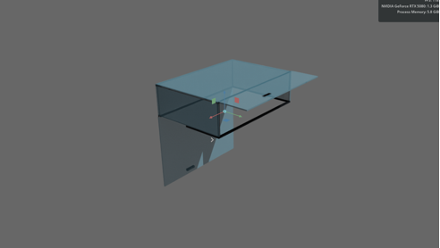
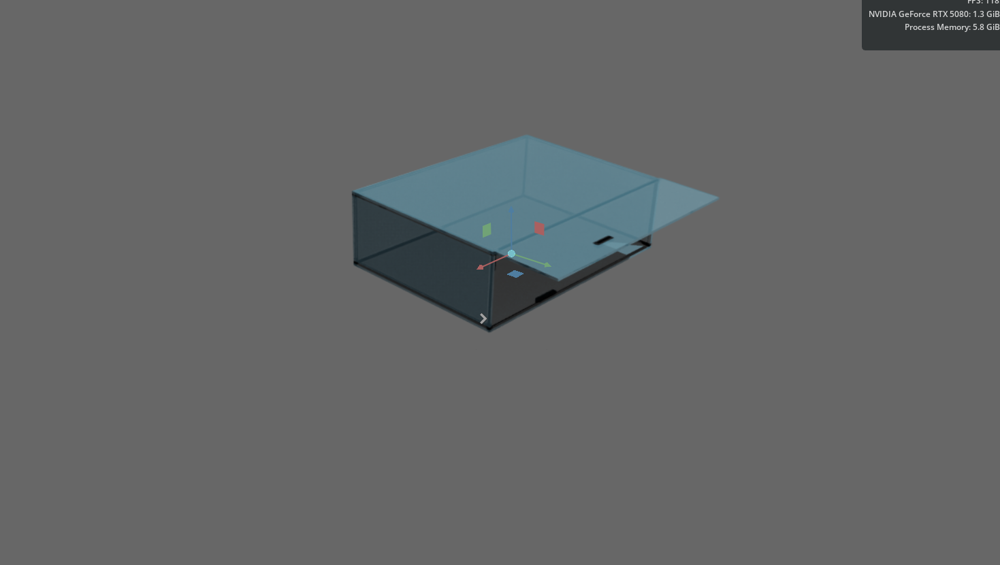

# 模块五：货舱资产加载与控制

说明目标：

- 了解项目包中独立货舱 USD 资产的位置。
- 能在 Isaac Sim 中单独加载货舱资产。
- 能通过 ROS 2 字符串话题发送货舱开关指令。
- 能区分货舱控制链路和 PX4 飞控链路。

前置条件：

- Isaac Sim 能正常启动。
- 项目包位于 `/home/robot-a/Desktop/drone_training_github_release`。
- 如果需要用脚本控制货舱，ROS 2 环境已经安装并能 source。


### 01 货舱资产位置

项目包中包含两个独立货舱相关 USD：

```text
assets/cargo_bay/cargo_bay_resized_0p2_0p14_0p06.usd
assets/cargo_bay/air_fpv_box.usd
```

其中：

| 文件 | 作用 |
| --- | --- |
| `cargo_bay_resized_0p2_0p14_0p06.usd` | 独立货舱模型，适合单独加载检查结构和尺寸 |
| `air_fpv_box.usd` | 货物 / 箱体模型，可用于货舱开关动作验证 |

自定义无人机资产中也包含货舱相关引用：

```text
assets/robots/sunray150_with_mid360_cargo/sunray150_with_mid360_cargo.usda
assets/robots/sunray150_with_mid360_cargo/air_fpv_box.usd
```





仅检查货舱本体时，不需要先加载 PX4 或 Pegasus 的无人机 backend。


### 02 单独加载货舱

打开终端，进入项目包目录：

```bash
cd /home/robot-a/Desktop/drone_training_github_release
./run_load_cargo_bay.sh
```

脚本会调用 Isaac Sim，并执行：

```text
isaac/load_cargo_bay.py
```

如果 Isaac Sim 不在默认路径，可以先设置：

```bash
export ISAACSIM_BIN=/home/robot-a/miniconda3/envs/env_isaacsim/bin/isaacsim
cd /home/robot-a/Desktop/drone_training_github_release
./run_load_cargo_bay.sh
```

加载后，在 Stage 中检查是否出现货舱相关 prim。若仅需要确认 USD 能否打开，应避免同时启动 PX4、QGC 或 Offboard 控制脚本，以免混淆资产问题和飞控问题。


### 03 货舱控制脚本

货舱控制使用项目包里的脚本：

```bash
cd /home/robot-a/Desktop/drone_training_github_release
./run_cargo_bay_control.sh status
./run_cargo_bay_control.sh left_open
./run_cargo_bay_control.sh left_close
./run_cargo_bay_control.sh bottom_open
./run_cargo_bay_control.sh bottom_close
```

命令含义：

| 命令 | 作用 |
| --- | --- |
| `status` | 查询或请求输出货舱当前状态 |
| `left_open` | 打开左侧舱门 |
| `left_close` | 关闭左侧舱门 |
| `bottom_open` | 打开底部舱门 |
| `bottom_close` | 关闭底部舱门 |

侧面展开对应 `left_open` / `left_close`，底面展开对应 `bottom_open` / `bottom_close`。控制脚本只负责发送 ROS 2 字符串命令，具体舱门动作仍由 Isaac Sim 场景中的资产和控制逻辑执行。

脚本默认会依次尝试 source 可用的 ROS 2 环境，并优先使用 `PX4_ROS_WS` 指定的工作空间。如果使用单独工作空间，可以这样运行：

```bash
cd /home/robot-a/Desktop/drone_training_github_release
PX4_ROS_WS=/home/robot-a/Desktop/test_ws/ros2_px4_ws ./run_cargo_bay_control.sh status
```


### 04 ROS 2 话题说明

货舱控制只使用字符串话题，不直接依赖 PX4 Offboard：

```text
/cargo_bay/command
/cargo_bay/status
```

可以用 ROS 2 命令检查：

```bash
source /opt/ros/jazzy/setup.bash
ros2 topic list | grep cargo_bay
```

手动发布字符串命令的形式如下：

```bash
ros2 topic pub --once /cargo_bay/command std_msgs/msg/String "{data: 'left_open'}"
ros2 topic echo /cargo_bay/status
```

如果使用 Ubuntu 20.04 + Foxy 或 Ubuntu 22.04 + Humble，把 source 命令替换为对应版本：

```bash
source /opt/ros/foxy/setup.bash
```

```bash
source /opt/ros/humble/setup.bash
```


### 05 常见问题

货舱看不到时，先确认：

1. `assets/cargo_bay/` 下 USD 文件是否存在。
2. `run_load_cargo_bay.sh` 中的 `ISAACSIM_BIN` 是否指向正确 Isaac Sim。
3. Isaac Sim Stage 中是否出现货舱 prim。
4. 是否误把货舱控制问题当成 PX4 飞控问题。

控制命令无反应时，先确认：

1. 货舱加载脚本是否已经运行。
2. ROS 2 终端是否 source 了正确发行版。
3. `/cargo_bay/command` 和 `/cargo_bay/status` 是否存在。
4. 控制脚本是否使用了系统 Python，而不是 conda Python。

货舱模块用于资产加载和 ROS 2 字符串控制验证，不等同于 PX4 飞行控制。PX4 的起飞、移动、降落仍然使用模块三的 Offboard 控制菜单。
