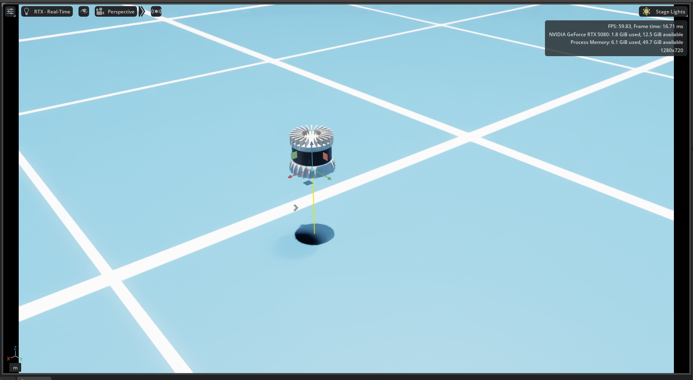
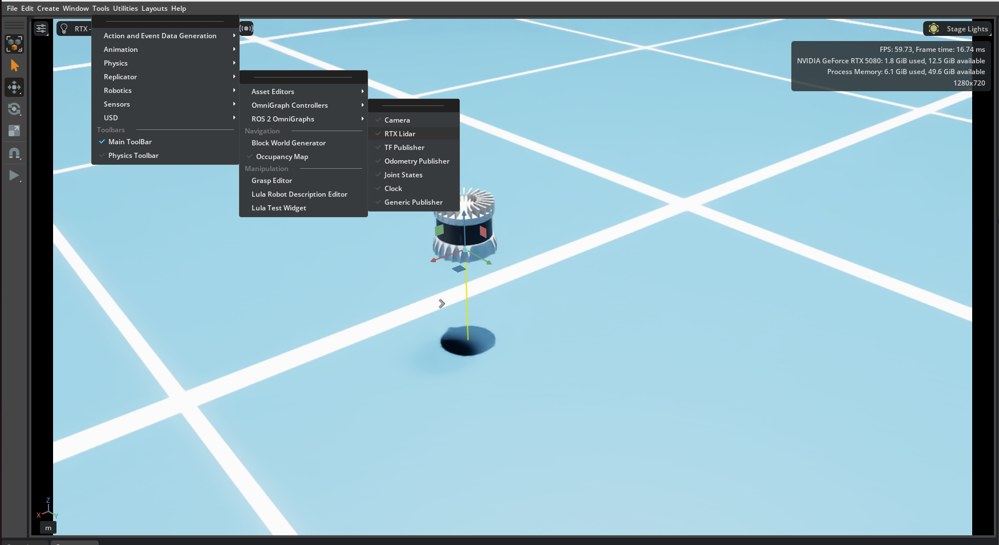
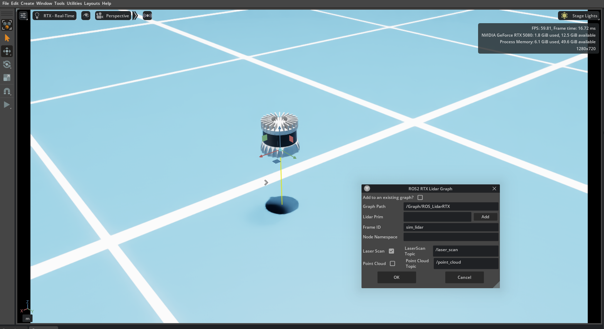
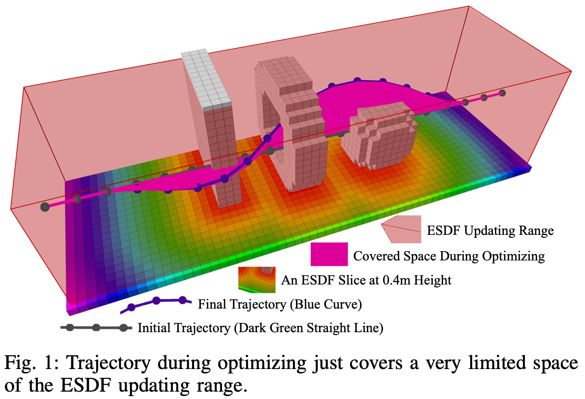

# 模块六：雷达点云与 EGO-Planner 避障

本节说明 Isaac Sim 中的雷达感知、ROS 2 感知话题、坐标变换、里程计，以及 EGO-Planner 在本项目中的接入方式。文档重点是数据链路和算法原理：仿真环境负责产生传感器数据和无人机状态，EGO-Planner 负责根据局部障碍物点云和目标点生成轨迹，桥接节点负责把各系统的数据格式连接起来。

默认目录为：

```bash
/home/robot-a/Desktop/drone_training_github_release
```

默认外部 ROS 2 工作空间为：

```bash
/home/robot-a/ros2_ws
```

其中需要已经存在并编译通过：

```text
ego_planner
quadrotor_msgs
px4_msgs
```

## 01 Isaac Sim 中的雷达感知

Isaac Sim 可以模拟激光雷达传感器。雷达在仿真中并不是简单的可视模型，而是一个传感器 prim：它随无人机运动，按照配置参数扫描周围几何体，并将扫描结果输出为 `sensor_msgs/msg/PointCloud2` 点云。对于局部避障系统，点云提供的是障碍物在传感器视场内的空间分布。

本项目使用 RTX LiDAR。相关创建逻辑位于：

```text
isaac/ego_demo/stage_common.py
```



主要配置如下：

| 项目 | 值 | 说明 |
| --- | --- | --- |
| 雷达类型 | RTX LiDAR | Isaac Sim 的 RTX 传感器 |
| 配置名 | `OS0_REV7_128ch10hz512res` | 雷达扫描配置 |
| 挂载父 prim | `/World/quadrotor/body` | 雷达固定在无人机机体上 |
| 雷达 frame | `lidar_link` | 点云消息使用的坐标系 |
| 相对机体偏移 | `(0.0, 0.0, 0.12)` | 雷达相对 `base_link` 的安装位置 |
| 原始点云话题 | `/training/lidar/pointcloud` | Isaac Sim 发布的 PointCloud2 |

`stage_common.py` 通过 Isaac 命令创建雷达：

```python
IsaacSensorCreateRtxLidar
```

创建后，代码会把雷达 prim 及其子 prim 设为不可见。视口中看不到雷达模型，不表示传感器没有运行。可见性只影响渲染显示；只要传感器 prim 存在、render product 正常创建、ROS 2 ActionGraph 正常连接，点云仍会发布。

当前保留的 Isaac 场景入口为：

```text
isaac/ego_demo/stage_04_publish_tf_odom.py
```

该入口调用 `stage_common.py`，并启用四类功能：

```python
enable_lidar=True
enable_pointcloud=True
enable_state_bridge=True
default_no_px4_autolaunch=False
```

含义如下：

| 配置 | 作用 |
| --- | --- |
| `enable_lidar=True` | 创建并挂载 RTX LiDAR |
| `enable_pointcloud=True` | 发布 `/training/lidar/pointcloud` 和 `/clock` |
| `enable_state_bridge=True` | 发布 `/tf`、`/tf_static`、`/drone_0_ego_odom` |
| `default_no_px4_autolaunch=False` | 默认启用 Pegasus 的 PX4 backend |

场景由代码生成，包含地面、三个箱体障碍物和无人机：

```text
/World/ground
/World/training_obstacles/box_center
/World/training_obstacles/box_left
/World/training_obstacles/box_right
/World/quadrotor
```

默认起点为 `(0, 0, 1.0)`，默认目标为 `(6, 0, 1.0)`。三个障碍物放在起点和目标之间，用于形成需要绕行的局部环境。

## 02 ROS 2 感知话题与坐标关系

EGO-Planner 不能只依赖点云。局部规划至少需要三个信息来源：

| 信息 | 本项目话题 | 作用 |
| --- | --- | --- |
| 局部障碍物点云 | `/drone_0_ego_cloud` | 构建局部占据地图 |
| 无人机状态 | `/drone_0_ego_odom` | 提供当前位置、姿态、速度 |
| 目标点 | `/move_base_simple/goal` | 提供规划终点或局部目标方向 |

Isaac Sim 侧还需要提供时间和坐标变换：

```text
/clock
/tf
/tf_static
```

这些话题共同构成以下链路：

```text
Isaac Sim RTX LiDAR
  -> /training/lidar/pointcloud      frame=lidar_link
  -> cloud_bridge + TF
  -> /drone_0_ego_cloud              frame=map
  -> ego_planner_node
  -> /drone_0_planning/bspline
  -> traj_server
  -> /position_cmd
  -> ego_px4_bridge
  -> /fmu/in/trajectory_setpoint
```



### `/clock`

`/clock` 是仿真时间。ROS 2 节点启用 `use_sim_time=True` 后，节点时间来自 `/clock`，而不是主机系统时间。

仿真系统中必须保持点云、TF、Odom 和规划节点的时间一致。时间不一致时，TF 查询可能失败，点云转换可能被拒绝，规划节点也可能认为输入数据过期。

Isaac 侧通过 `ROS2PublishClock` 发布该话题。

### `/tf`：动态坐标变换

`/tf` 用于发布随时间变化的坐标变换。本项目中主要发布：

```text
map -> base_link
```

含义是：无人机机体系 `base_link` 在规划坐标系 `map` 下的位置和姿态。无人机运动时，这个变换持续更新。

Isaac 侧通过 `ROS2PublishRawTransformTree` 发布该动态 TF，具体数值来自 Pegasus 无人机状态。

### `/tf_static`：静态坐标变换

`/tf_static` 用于发布固定安装关系。本项目中主要发布：

```text
base_link -> lidar_link
```

含义是：雷达坐标系 `lidar_link` 相对机体系 `base_link` 的固定安装位姿。当前平移为：

```text
(0.0, 0.0, 0.12)
```

雷达固定安装在无人机上，因此这条变换不随时间变化。

完整坐标链为：

```text
map -> base_link -> lidar_link
```

`cloud_bridge` 依赖这条 TF 链，将雷达坐标系下的点云转换到 `map` 坐标系。

### `/drone_0_ego_odom`

`/drone_0_ego_odom` 不是 PX4 原生发布的话题，而是本项目在 Isaac Sim 中通过 `ROS2PublishOdometry` 创建的规划里程计话题。

消息类型为：

```text
nav_msgs/msg/Odometry
```

该消息不是单个坐标点，而是一组运动状态，主要包含：

```text
pose.pose.position
pose.pose.orientation
twist.twist.linear
twist.twist.angular
```

在本项目中，它表示：

```text
base_link 在 map 坐标系下的位置、姿态、线速度和角速度
```

PX4 常见输出话题包括：

```text
/fmu/out/vehicle_local_position
/fmu/out/vehicle_odometry
/fmu/out/vehicle_status
```

这些话题与 `/drone_0_ego_odom` 不同。`/drone_0_ego_odom` 是面向 EGO-Planner 的 ROS 2 里程计输入，frame 设计与 `map -> base_link` TF 保持一致。

## 03 原始点云与规划点云

Isaac Sim 直接发布的点云为：

```text
/training/lidar/pointcloud
```

该话题由 `ROS2RtxLidarHelper` 发布，消息 frame 为：

```text
lidar_link
```



它表示雷达自身坐标系下看到的点。这个话题适合检查雷达是否工作，但不适合作为 EGO-Planner 的最终输入。规划节点需要在统一世界坐标系下理解障碍物位置，否则无人机运动后，点云坐标会随雷达坐标系一起变化，局部地图无法稳定维护。

EGO-Planner 使用的点云为：

```text
/drone_0_ego_cloud
```

该话题由本项目 ROS 2 节点 `cloud_bridge` 发布。处理过程如下：

1. 订阅 `/training/lidar/pointcloud`。
2. 查询 `map -> base_link -> lidar_link` 的 TF 链。
3. 将点云从 `lidar_link` 转换到 `map`。
4. 过滤无人机自身附近的点。
5. 根据参数决定是否累积多帧点云。
6. 发布 `/drone_0_ego_cloud`。

二者区别如下：

| 话题 | 发布者 | 坐标系 | 用途 |
| --- | --- | --- | --- |
| `/training/lidar/pointcloud` | Isaac Sim | `lidar_link` | 原始传感器输出 |
| `/drone_0_ego_cloud` | `cloud_bridge` | `map` | EGO-Planner 的局部地图输入 |

自滤波和点云累积是桥接阶段的重要处理。自滤波用于避免无人机机体、货物或近距离结构被误认为障碍物；累积用于在雷达扫描存在稀疏或短时遮挡时保持局部地图稳定。累积窗口不宜过大，否则高速运动时可能把旧障碍位置保留过久。

## 04 EGO-Planner 算法结构

EGO-Planner 是局部在线轨迹重规划方法。它在飞行过程中持续接收无人机里程计、局部点云和目标点，不断生成新的短时轨迹。该方法不依赖预先构建的全局稠密地图，更强调局部感知、局部地图维护和实时重规划。

在本机源码中，EGO-Planner 位于：

```text
/home/robot-a/ros2_ws/src/ego-planner-swarm-ros2
```

核心模块包括：

| 模块 | 典型源码位置 | 作用 |
| --- | --- | --- |
| `GridMap` | `plan_env` | 根据点云和里程计维护局部占据栅格 |
| `EGOReplanFSM` | `plan_manage/src/ego_replan_fsm.cpp` | 管理等待目标、规划、执行和安全重规划流程 |
| `EGOPlannerManager` | `plan_manage/src/planner_manager.cpp` | 组织地图、搜索和 B-spline 优化 |
| `AStar` | `path_searching` | 在栅格地图中搜索可行引导路径 |
| `BsplineOptimizer` | `bspline_opt` | 优化 B-spline 控制点 |
| `traj_server` | `plan_manage/src/traj_server.cpp` | 将 B-spline 轨迹采样成控制命令 |

### 局部栅格地图

`GridMap` 将点云转换为占据栅格。每个栅格单元可被认为是未知、空闲或占据。点云进入后，系统根据传感器位置和点的位置更新局部区域，并对障碍物进行膨胀。障碍物膨胀后的地图用于规划安全距离判断。

局部地图的作用不是保存无限范围内的所有环境，而是在无人机附近维护一个固定尺寸的规划区域。常用尺寸由以下参数控制：

```text
map_size_x
map_size_y
map_size_z
local_update_range_z
```

如果地图范围太小，规划器看到的空间不足，容易频繁重规划或无法绕开障碍。范围过大则会增加地图更新和搜索负担。

### 点云融合与障碍膨胀

点云输入进入 `grid_map/cloud` 后，`GridMap` 会结合里程计更新当前局部地图。地图中的障碍物通常会被膨胀一段距离，这个距离由 `obstacles_inflation` 控制。

膨胀的意义是把无人机尺寸、定位误差、控制误差和轨迹跟踪误差折算到地图中。膨胀半径越大，规划结果越保守；膨胀半径过小，轨迹可能贴近障碍物。

`virtual_ceil_height` 用于设置虚拟高度上限，避免轨迹向不希望的高空区域扩展。`visualization_truncate_height` 主要影响可视化截断范围，不等同于规划安全边界。

### 重规划状态机

`EGOReplanFSM` 是规划流程的调度层。它订阅里程计和目标点，并定时触发规划检查。源码中可以看到：

```text
odom_world
/move_base_simple/goal
planning/bspline
planning/data_display
```

典型流程如下：

1. 等待有效里程计。
2. 等待目标点。
3. 根据当前位置、速度、加速度和目标点选择局部目标。
4. 生成或复用初始轨迹。
5. 调用 `EGOPlannerManager::reboundReplan(...)` 进行重规划。
6. 发布 `planning/bspline`。
7. 在轨迹执行过程中持续检查前方轨迹安全性。
8. 发现轨迹碰撞风险、目标变化或接近规划边界时重新规划。

状态机包含定时器。规划循环用于生成新轨迹，安全循环用于更频繁地检查当前轨迹是否仍可执行。这样可以减少仅依赖固定周期规划带来的延迟。

### 局部目标选择

实际目标可能在当前局部地图之外。EGO-Planner 通常不会直接对远距离目标一次性规划完整轨迹，而是根据 `planning_horizon` 选择一个局部目标。局部目标位于当前位置到最终目标的方向上，并限制在当前可规划范围内。

这种处理有两个目的：

1. 控制每次优化的空间范围和计算量。
2. 允许无人机在只看到局部环境的情况下逐段前进。

当无人机接近局部目标或发现新障碍时，规划器会继续生成下一段轨迹。

### 初始轨迹生成

B-spline 优化需要初始控制点。初始轨迹可能来自以下来源：

| 来源 | 使用场景 |
| --- | --- |
| 当前状态到局部目标的多项式轨迹 | 第一次规划或目标明显变化 |
| 上一条轨迹的剩余部分 | 连续重规划时保持轨迹连续性 |
| A* 引导路径 | 初始轨迹与障碍物冲突，需要搜索绕行方向 |

初始轨迹不一定满足最终要求。它提供一个可优化的起点，后端优化会继续调整控制点，使轨迹更平滑、更安全，并满足动力学约束。

### A* 搜索的作用

源码中 `BsplineOptimizer` 持有 `AStar` 对象，`planner_manager.cpp` 初始化时会创建并连接 `AStar` 与 `GridMap`。A* 在栅格地图中搜索从起点到目标附近的离散路径，主要用于为优化提供绕障方向。

A* 不是最终轨迹输出。它产生的是离散路径或引导信息。最终给控制器使用的是 B-spline 轨迹。

### B-spline 轨迹表示

EGO-Planner 使用 B-spline 表示轨迹。B-spline 轨迹由一组控制点和时间间隔定义。相邻控制点决定曲线形状，轨迹位置、速度和加速度可以通过曲线求导得到。

使用 B-spline 的原因包括：

| 特性 | 对轨迹规划的意义 |
| --- | --- |
| 曲线平滑 | 适合无人机连续运动 |
| 控制点数量有限 | 优化变量规模可控 |
| 局部可调 | 修改部分控制点不会剧烈影响整条轨迹 |
| 可计算导数 | 便于约束速度和加速度 |

### 优化目标

`BsplineOptimizer` 对控制点进行优化。典型代价项包括：

| 代价项 | 作用 |
| --- | --- |
| 平滑代价 | 减少轨迹抖动和不必要弯折 |
| 碰撞代价 | 让控制点和轨迹远离障碍物 |
| 可行性代价 | 限制速度和加速度 |
| 贴合代价 | 约束轨迹不要偏离初始轨迹过多 |
| 终端代价 | 使轨迹末端接近局部目标 |

源码中可以看到相关计算函数，例如：

```text
calcDistanceCostRebound
calcFitnessCost
calcSmoothnessCost
calcTerminalCost
calcFeasibilityCost
```

优化结果不是简单追求最短路径。对无人机而言，轨迹还必须满足速度、加速度、障碍物距离和连续性要求。某些情况下，稍长但更平滑、更安全的轨迹比贴近障碍物的短路径更合理。

### 速度和加速度约束

轨迹约束主要由以下参数控制：

```text
max_vel
max_acc
```

`max_vel` 限制规划轨迹的最大速度，`max_acc` 限制最大加速度。约束过大时，规划轨迹可能超出仿真无人机或 PX4 控制链路的实际跟踪能力；约束过小时，轨迹会更慢，避障动作也更保守。

`traj_server` 在接收 B-spline 后，会按时间采样轨迹，生成位置、速度、加速度命令：

```text
/position_cmd
```

该话题是后续控制桥接的直接输入。

### 碰撞检测与安全重规划

EGO-Planner 不只在生成轨迹时检查碰撞，还会在执行过程中检查当前轨迹在新地图中是否仍然安全。雷达看到新障碍物后，局部地图会更新；如果原轨迹前方变成占据区域，状态机会触发新的规划。

安全重规划依赖三个条件：

1. 点云持续更新。
2. 里程计持续更新。
3. TF 和时间戳保持一致。

任意一项中断，规划器都可能无法判断轨迹是否安全。

## 05 EGO-Planner ROS 2 接口

本项目使用 EGO 包中的两个核心可执行节点：

| 节点 | 来源包 | 作用 |
| --- | --- | --- |
| `ego_planner_node` | `ego_planner` | 接收里程计、点云和目标点，输出 B-spline 轨迹 |
| `traj_server` | `ego_planner` | 将 B-spline 轨迹转换为 `/position_cmd` |

EGO 的 launch 入口为：

```text
/home/robot-a/ros2_ws/src/ego-planner-swarm-ros2/src/planner/plan_manage/launch/advanced_param.launch.py
```

该 launch 启动 `ego_planner_node`，并进行话题 remap。关键映射如下：

| EGO 内部话题 | 本项目实际话题 |
| --- | --- |
| `odom_world` | `/drone_0_ego_odom` |
| `grid_map/odom` | `/drone_0_ego_odom` |
| `grid_map/cloud` | `/drone_0_ego_cloud` |
| `planning/bspline` | `/drone_0_planning/bspline` |
| `planning/data_display` | `/drone_0_planning/data_display` |
| `grid_map/occupancy_inflate` | `/drone_0_grid/grid_map/occupancy_inflate` |

目标点话题为：

```text
/move_base_simple/goal
```

默认使用 `geometry_msgs/msg/PoseStamped`。目标点 frame 应为 `map`，并与 `frame_id` 参数一致。

EGO 输入如下：

| 话题 | 类型 | 来源 | 说明 |
| --- | --- | --- | --- |
| `/drone_0_ego_cloud` | `sensor_msgs/msg/PointCloud2` | `cloud_bridge` | `map` 坐标系下的局部障碍物点云 |
| `/drone_0_ego_odom` | `nav_msgs/msg/Odometry` | Isaac ActionGraph | `base_link` 在 `map` 下的运动状态 |
| `/move_base_simple/goal` | `geometry_msgs/msg/PoseStamped` | `goal_sender` 或手动发布 | 目标点 |

EGO 输出如下：

| 话题 | 类型 | 说明 |
| --- | --- | --- |
| `/drone_0_planning/bspline` | `traj_utils/msg/Bspline` | 规划出的 B-spline 轨迹 |
| `/drone_0_planning/data_display` | `traj_utils/msg/DataDisp` | 规划过程可视化数据 |
| `/drone_0_grid/grid_map/occupancy_inflate` | `sensor_msgs/msg/PointCloud2` | 膨胀后的局部占据地图 |
| `/position_cmd` | `quadrotor_msgs/msg/PositionCommand` | `traj_server` 输出的位置、速度、加速度命令 |

`/position_cmd` 不是 PX4 原生消息。它是 EGO 体系常用的轨迹跟踪命令，本项目再通过 `ego_px4_bridge` 转换为 PX4 Offboard 输入。

## 06 本项目桥接节点

本项目新增的 ROS 2 包位于：

```text
ros2_ws/src/ego_training_demo
```

保留的桥接节点如下：

| 节点 | 文件 | 作用 |
| --- | --- | --- |
| `cloud_bridge` | `cloud_bridge.py` | 将 `/training/lidar/pointcloud` 转换为 `/drone_0_ego_cloud` |
| `goal_sender` | `goal_sender.py` | 按参数发布默认目标点 `/move_base_simple/goal` |
| `position_cmd_monitor` | `position_cmd_monitor.py` | 订阅 `/position_cmd`，确认规划输出是否连续 |
| `ego_px4_bridge` | `ego_px4_bridge.py` | 将 `/position_cmd` 转换为 PX4 Offboard 控制输入 |

`stage_05_ego_dryrun.launch.py` 启动以下节点：

```text
ego_planner_node
traj_server
cloud_bridge
position_cmd_monitor
goal_sender  可选
```

`stage_06_ego_px4.launch.py` 在上述基础上增加：

```text
ego_px4_bridge
```

### `cloud_bridge`

`cloud_bridge` 是点云坐标统一节点。它订阅 Isaac 原始点云，查询 TF，将点云转换到 `map`，然后发布给 EGO-Planner。

主要参数包括：

| 参数 | 默认值 | 作用 |
| --- | --- | --- |
| `accumulate_cloud` | `true` | 是否累积多帧点云 |
| `accumulation_window_s` | `0.12` | 点云累积时间窗口 |
| `max_accumulated_frames` | `8` | 最多保留帧数 |
| `self_filter_min_range` | `0.45` | 过滤近距离点 |
| `self_filter_xy_radius` | `0.45` | 过滤机体水平半径内点 |
| `self_filter_z_radius` | `0.75` | 过滤机体高度范围内点 |

### `goal_sender`

`goal_sender` 用于发布默认目标点。默认目标为：

```text
(6.0, 0.0, 1.0)
```

该节点由 `send_default_goal` 参数控制。若 `send_default_goal=false`，系统不会自动发目标点，需要另行发布 `/move_base_simple/goal`。

### `position_cmd_monitor`

`position_cmd_monitor` 用于检查 `/position_cmd` 是否持续输出，并检查 frame 是否符合预期。它不参与控制，只用于运行状态确认。

### `ego_px4_bridge`

`ego_px4_bridge` 将 `/position_cmd` 转换为 PX4 Offboard 相关输入：

```text
/fmu/in/offboard_control_mode
/fmu/in/trajectory_setpoint
/fmu/in/vehicle_command
```

其中 `auto_arm` 和 `auto_offboard` 控制是否自动发送解锁和 Offboard 切换命令。使用该节点前，需要确认 PX4 与 ROS 2 的 Micro XRCE-DDS 链路正常。

## 07 参数说明

### 坐标和话题参数

| 参数 | 默认值 | 说明 |
| --- | --- | --- |
| `drone_id` | `0` | 无人机编号，用于生成 `/drone_0_*` 话题 |
| `frame_id` | `map` | EGO 规划坐标系 |
| `odom_topic` | `ego_odom` | 拼接为 `/drone_0_ego_odom` |
| `cloud_topic` | `ego_cloud` | 拼接为 `/drone_0_ego_cloud` |
| `send_default_goal` | `false` | 是否自动发布默认目标 |

### 感知地图参数

| 参数 | 默认值 | 说明 |
| --- | --- | --- |
| `map_size_x` | `12.0` | 局部地图 x 方向尺寸 |
| `map_size_y` | `12.0` | 局部地图 y 方向尺寸 |
| `map_size_z` | `4.0` | 局部地图 z 方向尺寸 |
| `local_update_range_z` | `4.0` | z 方向局部更新范围 |
| `obstacles_inflation` | `0.25` | 障碍物膨胀半径 |
| `virtual_ceil_height` | `3.0` | 虚拟高度上限 |
| `visualization_truncate_height` | `3.0` | 可视化截断高度 |

调整原则：

| 现象 | 可检查参数 |
| --- | --- |
| 轨迹贴近障碍物 | 增大 `obstacles_inflation` |
| 局部地图范围不足 | 增大 `map_size_x`、`map_size_y` 或 `planning_horizon` |
| 轨迹高度异常 | 检查 `virtual_ceil_height` 和目标点 z 值 |
| 可视化点云显示范围不符合预期 | 检查 `visualization_truncate_height` |

### 轨迹约束参数

| 参数 | 默认值 | 说明 |
| --- | --- | --- |
| `max_vel` | `1.0` | 规划最大速度 |
| `max_acc` | `2.0` | 规划最大加速度 |
| `planning_horizon` | `6.0` | 局部规划前视距离 |

速度和加速度参数需要与 PX4 控制能力、仿真无人机动力学和场景尺度匹配。规划器输出很激进时，PX4 可能无法稳定跟踪；规划器过于保守时，避障过程会变慢。

### 点云桥接参数

| 参数 | 默认值 | 说明 |
| --- | --- | --- |
| `accumulate_cloud` | `true` | 是否进行点云累积 |
| `accumulation_window_s` | `0.12` | 累积时间窗口 |
| `max_accumulated_frames` | `8` | 累积帧数上限 |
| `self_filter_min_range` | `0.45` | 最小距离过滤 |
| `self_filter_xy_radius` | `0.45` | 机体水平范围过滤 |
| `self_filter_z_radius` | `0.75` | 机体高度范围过滤 |

### PX4 桥接参数

| 参数 | 默认值 | 说明 |
| --- | --- | --- |
| `auto_arm` | `true` | 是否自动发送解锁命令 |
| `auto_offboard` | `true` | 是否自动请求 Offboard 模式 |

## 08 本项目使用流程

### 编译 ROS 2 overlay

在运行 EGO 相关 launch 前，需要先编译本项目 ROS 2 包：

```bash
cd /home/robot-a/Desktop/drone_training_github_release/ros2_ws
source /opt/ros/jazzy/setup.bash
source /home/robot-a/ros2_ws/install/setup.bash
colcon build --packages-select ego_training_demo
```

运行时需要 source 两层环境：

```bash
source /opt/ros/jazzy/setup.bash
source /home/robot-a/ros2_ws/install/setup.bash
source /home/robot-a/Desktop/drone_training_github_release/ros2_ws/install/setup.bash
```

根目录脚本会按当前环境做自动探测，但手动调试时建议明确 source。

### 启动 Isaac 场景

Isaac 侧主入口为：

```bash
cd /home/robot-a/Desktop/drone_training_github_release
./run_ego_stage_04.sh
```

该脚本启动 Isaac Sim，并加载：

```text
无人机资产
三个箱体障碍物
隐藏 RTX LiDAR
点云发布 ActionGraph
Clock 发布 ActionGraph
TF/Odom 发布 ActionGraph
PX4 backend
```

该入口负责产生规划所需的仿真数据，不负责启动 EGO-Planner。

### 验证 Isaac 输出

另开 ROS 2 终端：

```bash
source /opt/ros/jazzy/setup.bash
source /home/robot-a/ros2_ws/install/setup.bash
source /home/robot-a/Desktop/drone_training_github_release/ros2_ws/install/setup.bash
```

检查点云：

```bash
ros2 topic echo /training/lidar/pointcloud --once
```

检查里程计：

```bash
ros2 topic echo /drone_0_ego_odom --once
```

检查 TF 和时间：

```bash
ros2 topic echo /tf --once
ros2 topic echo /tf_static --once
ros2 topic echo /clock --once
```

检查 TF 树时，可使用：

```bash
ros2 run tf2_ros tf2_echo map base_link
ros2 run tf2_ros tf2_echo base_link lidar_link
```

### 验证 EGO-Planner 输出

运行：

```bash
cd /home/robot-a/Desktop/drone_training_github_release
./run_ego_stage_05.sh send_default_goal:=true
```

该脚本启动点云桥接、EGO-Planner、`traj_server` 和 `/position_cmd` 监视节点。验证重点是 EGO 是否能持续输出：

```bash
ros2 topic echo /drone_0_ego_cloud --once
ros2 topic echo /drone_0_planning/bspline --once
ros2 topic echo /position_cmd --once
```



如果不使用默认目标点，需要自行发布：

```bash
ros2 topic pub --once /move_base_simple/goal geometry_msgs/msg/PoseStamped "{
  header: {frame_id: 'map'},
  pose: {
    position: {x: 6.0, y: 0.0, z: 1.0},
    orientation: {w: 1.0}
  }
}"
```

### 接入 PX4 Offboard

确认 PX4 与 ROS 2 bridge 正常后，检查 PX4 话题：

```bash
ros2 topic list | grep /fmu
```

然后运行：

```bash
cd /home/robot-a/Desktop/drone_training_github_release
./run_ego_stage_06.sh send_default_goal:=true
```

该脚本在 Stage 05 的基础上增加 `ego_px4_bridge`。桥接节点会发布：

```text
/fmu/in/offboard_control_mode
/fmu/in/trajectory_setpoint
/fmu/in/vehicle_command
```

可检查：

```bash
ros2 topic echo /fmu/in/trajectory_setpoint --once
ros2 topic echo /fmu/in/offboard_control_mode --once
```

## 09 常见检查顺序

### 没有 `/training/lidar/pointcloud`

按顺序检查：

1. `run_ego_stage_04.sh` 是否正常启动。
2. Isaac Sim 是否加载了 `/World/quadrotor/body`。
3. `stage_common.py` 是否成功创建 RTX LiDAR。
4. `ROS2RtxLidarHelper` 所在 ActionGraph 是否创建。
5. ROS 2 bridge 环境是否与当前 ROS 2 终端一致。

### 有原始点云，但没有 `/drone_0_ego_cloud`

按顺序检查：

1. `cloud_bridge` 是否启动。
2. `/tf` 是否有 `map -> base_link`。
3. `/tf_static` 是否有 `base_link -> lidar_link`。
4. 原始点云 frame 是否为 `lidar_link`。
5. `frame_id` 是否为 `map`。

### 有规划点云，但没有 `/position_cmd`

按顺序检查：

1. `/drone_0_ego_odom` 是否有数据。
2. `/move_base_simple/goal` 是否已经发布。
3. 目标点 frame 是否为 `map`。
4. `ego_planner_node` 是否启动。
5. `/drone_0_planning/bspline` 是否有数据。
6. `traj_server` 是否启动并订阅正确的 B-spline 话题。

### PX4 没有动作

按顺序检查：

1. `/position_cmd` 是否持续输出。
2. `/fmu/in/trajectory_setpoint` 是否持续输出。
3. `/fmu/in/offboard_control_mode` 是否持续输出。
4. `/fmu/in/vehicle_command` 是否发送解锁和模式切换命令。
5. QGC 中 PX4 是否已连接，模式是否进入 `OFFBOARD`，状态是否为 `ARMED`。

更多环境和启动问题见：

```text
docs/07_疑难杂症_QA.md
```
